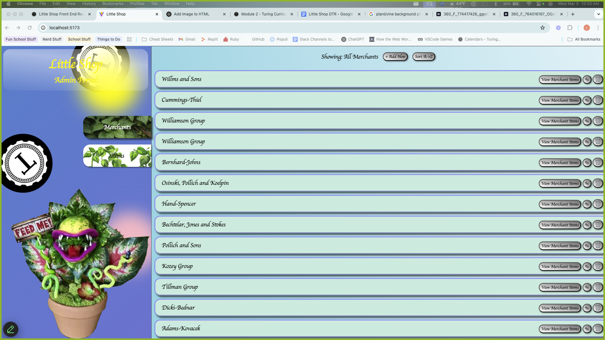

# Hang in There  

### Abstract:
(Briefly describe what you built and its features. What problem is the app solving? How does this application solve that problem?)
  - We built and API to access and manipulate databases from a separate front end application.
  - It is allowing us to view all of the merchants and items in our database and allows us to see what all items a single merchant carries.
  - It solves the problem by showing a visual display of information in out databases that make the information more accessable and mutable.

### Installation Instructions:
(What steps does a person have to take to get your app cloned down and running?)
  - To get the back end of our app cloned down and useable you would need to clone the repo that we have on Joe's github. 
    - Once you have it cloned down you will need to run a bundle install and rails db:{drop,create,seed} to get the data necessary then run your rails server so it can interact with the front end. 
  - To get the front end of our app cloned down and useable you would need to clone down the repo from Logan's github.
    - Once it is cloned down you need to do an npm install then 'npm run dev' along with the back end rails server to run the entire application.

### Preview of App:
(Provide ONE gif or screenshot of your application - choose the "coolest" piece of functionality to show off. gifs preferred!)
  - 

### Context:
(Give some context for the project here. How long did you have to work on it? What specific work/improvements did you contribute to this FE application?)
- We had a couple full days to work on the front end. We prioritized the functionality and the requrements and once we had those completed we were able to do more extra stying and functionality.
- As far as specific improvements we added some animations, gradient coloring, gifs, photos, hover effects on buttons and added a sort and undo sort buttons. 

### Contributors:
(Who worked on this application? Link to your GitHub. Consider also providing LinkedIn link)
- [Joe_Bloom](https://www.linkedin.com/in/josephsbloom/)
- [Jaren_Garman](https://linkedin.com/in/jarengarman)
- [Donte_Handy](https://www.linkedin.com/in/dontehandy/)
- [Logan_Sauer](https://www.linkedin.com/in/ldsauer/)

### Learning Goals:
(What were the learning goals of this project? What tech did you work with?)
- Learning goals were how to build an API basically from the groud up and to incorporate it with a front end application so the two work in unison. Also learned more about styling a front end application. 
- The tech that we used was FactoryBot and Faker to help create dummy objects, CSS for styling, javascrpit to communicate with our back end and GitHub Projects to stay organized with tasks. 

### Wins + Challenges:
(What are 2-3 wins you have from this project? What were some challenges you faced - and how did you get over them?)
- On the front end we were having some issues where the items and merchant specific items would not go away once navigating back to the merchants page. After scouring the CSS, HTML and JavaScript files identified that it was an id vs class priority issue. 
- There was a bit of an issue working to get the merchant_serializer to accept conditional attributes. To find a soultion we brought in Jaren (the expert) and used teamwork to work through the issue. 
- The failing Postman test were a pretty big challenge for Jaren. He worked really hard to with all forms of error handling. After exhausting all options he went to the instructor to show that there was an issue with the actual error handling itself. 
